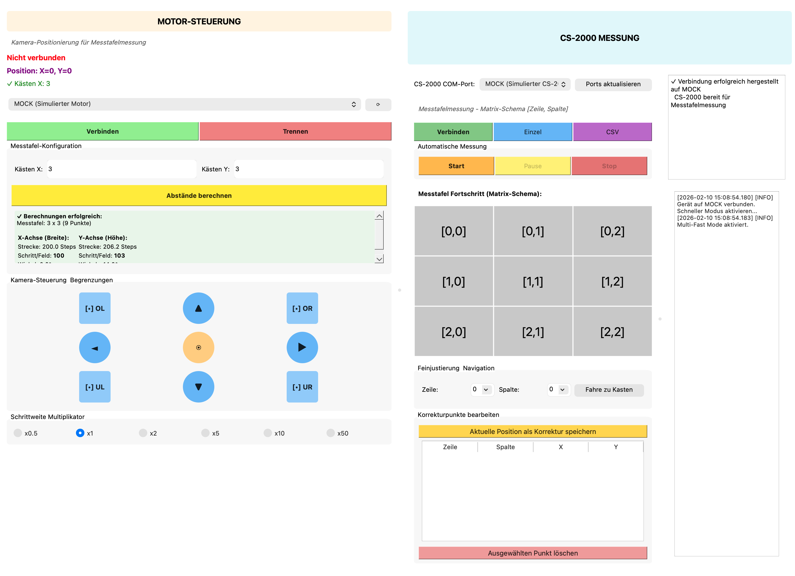

# Mechatronik Stativ Control Software

## Overview
This Python program controls a 2-axis stand (ESP32-based) and synchronously reads measurement data from a Konica Minolta CS-2000 spectroradiometer. The goal is the automated measurement of displays or test charts in a defined grid.



## Core Functions

### Main Module (`main.py`)
- Entry point of the application (`QApplication`).
- Initializes the main window (`HauptFenster`), which combines two main areas:
  - Left: Motor Control (`MotorSteuerung` Widget from `esp32_module.py`)
  - Right: CS-2000 Control & Visualization (`CS2000GUI` from `cs2000_module.py`)

### Motor Control (`esp32_module.py`)
- **Connection:** Establishes a serial connection to the ESP32 (or uses MOCK mode).
- **Control:** Allows manual movement (arrow keys, buttons) and setting boundaries (Top-Left, Bottom-Left, Bottom-Right).
- **Calculation:** Determines the necessary steps per field and the overall geometry based on the corner points and the number of boxes (X/Y).
- **Worker:** Uses `SerialWorker` in the background for non-blocking communication.

### CS-2000 Module (`cs2000_module.py`)
- **Measurement:** Controls the spectroradiometer via serial commands (`MEAS`, `MEDR`).
- **Automation (`MesstafelWorker`):** 
  - Automatically traverses the grid (Snake-Path).
  - Uses `scipy.interpolate` to interpolate positions between corner points (correcting mechanical inaccuracies).
  - Performs a measurement at each point and saves spectral data as well as color values (x, y, Y).
- **Visualization (`MesstafelVisualization`):** Graphically displays progress (color codes for Open, Measuring, Finished, Error).

## Program Flow (PAP)


## Setup & Installation

The application runs on Windows but typically requires some setup if moved to a new environment.

### Prerequisites

1.  **Python 3.x**: Ensure Python is installed.
    -   Download from [python.org](https://www.python.org/downloads/windows/).
    -   **Important**: Check the box **"Add Python to PATH"** during installation.

### Installation Steps

1.  **Open Command Prompt (cmd)**
    -   Press `Win + R`, type `cmd`, and press Enter.
    -   Navigate to the project folder:
        ```cmd
        cd path\to\Mechatronik_Stativ
        ```

2.  **Create a Virtual Environment (Recommended)**
    -   This keeps your system clean.
    ```cmd
    python -m venv venv
    ```

3.  **Activate the Environment**
    ```cmd
    .\venv\Scripts\activate
    ```
    *(You should see `(venv)` at the start of your command line now.)*

4.  **Install Dependencies**
    ```cmd
    pip install -r Python/requirements.txt
    ```

## Usage

### Running the App
1.  Make sure your virtual environment is activated (`(venv)` is visible).
2.  Run the main script from the `Python` directory:
    ```cmd
    cd Python
    python main.py
    ```

### Using the Interface
- **MOCK-Mode:** If no hardware is connected, "MOCK" can be selected in the port dropdown to simulate the process.
- **Interpolation:** For precise positioning, manual correction points can be set, which are included in the path calculation by `scipy`.

## Dependencies

| Package | Purpose |
| :--- | :--- |
| **PyQt5** | Creation of the graphical user interface (windows, buttons, signals/slots). |
| **pyserial** | Serial communication with the stand (ESP32) and the measuring device (CS-2000). |
| **numpy** | Numerical calculations, especially for arrays and matrices in data processing. |
| **scipy** | Scientific calculations. Specifically `scipy.interpolate.griddata` for spatial interpolation of target positions. |
| **pyinstaller** | (Optional) Used to compile the Python script into an executable `.exe` or `.app` file. |

## Build Standalone .exe
If you want to run the app on a Windows PC without installing Python, you can build an executable file.

1.  **Install PyInstaller**
    ```cmd
    pip install pyinstaller
    ```

2.  **Build the EXE**
    Run the following command in the `Python` directory:
    ```cmd
    cd Python
    pyinstaller --noconfirm --onefile --windowed --name "Messtafel_App" --add-data "config.json;." main.py
    ```
    -   `--onefile`: Creates a single .exe file.
    -   `--windowed`: Hides the black console window when running the app.
    -   `--add-data`: Includes the config file.

3.  **Result**
    -   The `Messtafel_App.exe` will be in the `dist` folder.

## License

This project is licensed under the **GNU General Public License v3.0 (GPLv3)**.  
See the [LICENSE](LICENSE) file for details.

Permissions of this strong copyleft license are conditioned on making available complete source code of licensed works and modifications, which include larger works using a licensed work, under the same license. Copyright and license notices must be preserved. Contributors provide an express grant of patent rights.
